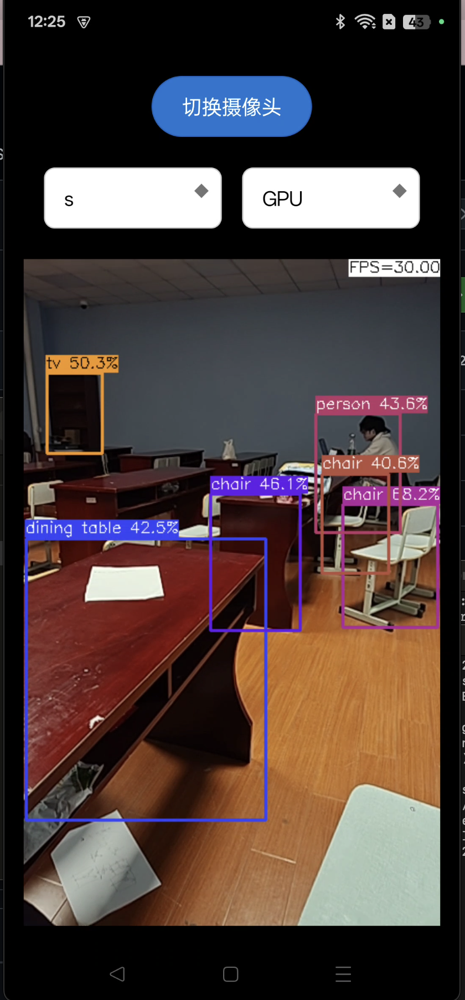

# YOLOv8 Android App with NCNN

这个Android应用程序演示了使用YOLOv8模型和NCNN框架进行实时物体检测。该应用具有现代UI设计和高效性能。

## 特性

- 使用相机实时物体检测
- 支持YOLOv8n和YOLOv8s模型
- 现代Material Design UI元素
- 高效的NCNN后端以实现最佳性能
- 支持多种CPU架构（arm64-v8a，armeabi-v7a，x86，x86_64）

## 实现逻辑

该应用程序利用相机视频流执行实时物体检测。以下步骤概述了核心逻辑：

1. **相机初始化**：应用程序使用Android NDK初始化相机以获得最佳性能。
2. **模型加载**：YOLOv8模型文件从assets目录加载。
3. **帧处理**：从相机捕获的每一帧通过NCNN框架处理以检测物体。
4. **显示结果**：检测到的物体在屏幕上以边界框和标签的形式显示。

## Requirements

- Android Studio 
- Android SDK 
- Android NDK
- OpenCV for Android
- NCNN framework

## Setup Instructions

1. Clone the repository
2. Open the project in Android Studio
3. Sync project with Gradle files
4. Build and run the application

## Project Structure

```
app/
├── src/
│   ├── main/
│   │   ├── assets/         # YOLOv8 model files
│   │   ├── java/          # Java source code
│   │   ├── jni/           # C++ source code
│   │   └── res/           # Android resources
└── build.gradle           # Project build configuration
```

## License

This project is licensed under the MIT License - see the LICENSE file for details.

## Acknowledgments

- NCNN framework by Tencent
- YOLOv8 by Ultralytics
- OpenCV Mobile

## Some Notes
* Android NDK camera is used for best efficiency
* Crash may happen on very old devices for lacking HAL3 camera interface
* All models are manually modified to accept dynamic input shape
* Most small models run slower on GPU than on CPU, this is common
* FPS may be lower in dark environments because of longer camera exposure time

## Screenshot


## Reference：  
https://github.com/nihui/ncnn-android-nanodet  
https://github.com/Tencent/ncnn  
https://github.com/ultralytics/assets/releases/tag/v0.0.0
